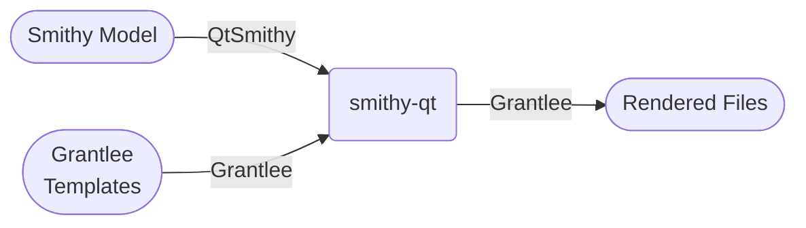
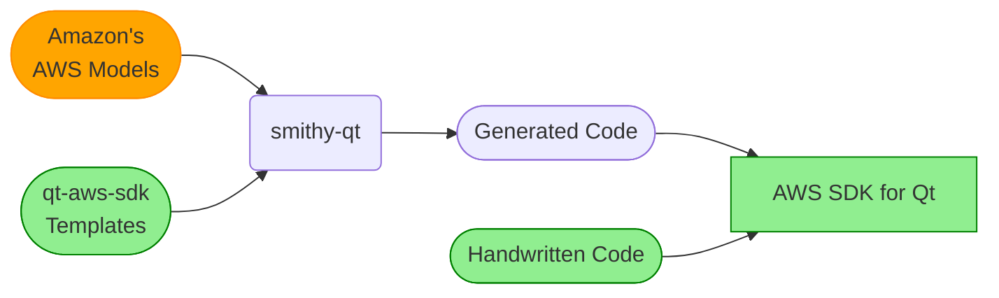

<!-- SPDX-FileCopyrightText: 2013-2022 Paul Colby <git@colby.id.au> -->
<!-- SPDX-License-Identifier: LGPL-3.0-or-later -->
# Smithy Qt

Smithy Qt is (or will be, eventually) two things:

1. `QtSmithy` - a cross-platform naitve [Qt] library for reading [Smithy] models; and
2. `smithy-qt` - a cross-platform CLI tool for rendering text files in response to [Smithy] models.

Smithy Qt is written in Qt, and optimised for generating Qt code (specifically for replacing
[QtAws]'s bespoke code generator), but by using the generic [Grantlee] templating engine, could be
used to generate code (or indeed non-code) for any language or technology.

[CMake]:    https://cmake.org/
[Grantlee]: https://github.com/steveire/grantlee
[Qt]:       https://www.qt.io/
[QtAws]:    https://github.com/pcolby/aws-sdk-qt "AWS SDK for Qt"
[Smithy]:   https://awslabs.github.io/smithy/
