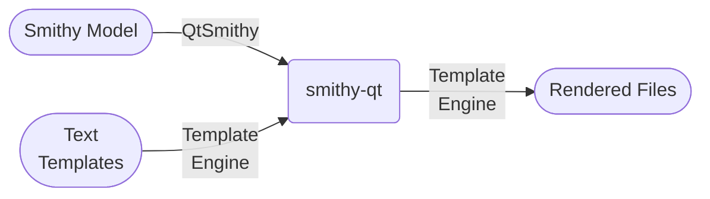
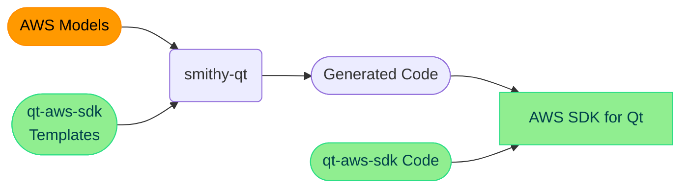

<!-- SPDX-FileCopyrightText: 2013-2024 Paul Colby <git@colby.id.au> -->
<!-- SPDX-License-Identifier: LGPL-3.0-or-later -->
# Smithy Qt

Smithy Qt is (or will be, eventually) two things:

1. `QtSmithy` - a cross-platform naitve [Qt] library for reading [Smithy] models; and
2. `smithy-qt` - a cross-platform CLI tool for rendering text files in response to [Smithy] models.

Smithy Qt is written in Qt, and optimised for generating Qt code (specifically for replacing
[QtAws]'s bespoke code generator), but by using a generic text templating engine, could be
used to generate code (or indeed non-code) for any language or technology.

### Text Templates

Smithy Qt uses a text template language that is very similar to [Django templates]. Specfically, `smithy-qt` uses either
the [Grantlee] or [Cutelee] library (the latter is a Qt6-compatible fork of the former).

> [!NOTE]
> Smithy Qt began using the [Grantlee] library with Qt5. However, the [Grantlee] author has moved the library to [KDE],
> where it is now known as [KTextTemplate], and the original [Grantlee] library has been retired. Meanwhile, the
> [Cutelyst] project has forked [Grantlee] to [Cutelee], and ported it to Qt6. Today, Smithy Qt supports both [Grantlee]
> (with Qt5) and [Cutelee] (with Qt6). Smithy Qt will most likely support [KTextTemplate] too, when that library becomes
> more readily available.

You can find the template language documention [here](https://pcolby.github.io/cutelee/for_themers.html). You can also
have a look at some of the [demo](demo) templates.

[CMake]:            https://cmake.org/ "CMake"
[Cutelee]:          https://github.com/cutelyst/cutelee "The Cutelee Libraries"
[Cutelyst]:         https://cutelyst.org/ "Cutelyst! The Qt Web Framework"
[Django templates]: https://docs.djangoproject.com/en/5.0/ref/templates/ "Django Templates"
[Grantlee]:         https://github.com/steveire/grantlee "The Grantlee Libraries"
[KDE]:              https://kde.org/ "KDE Community"
[KTextTemplate]:    https://invent.kde.org/frameworks/ktexttemplate "The KTextTemplate Library"
[Qt]:               https://www.qt.io/ "Qt cross-platform application development framework"
[QtAws]:            https://github.com/pcolby/aws-sdk-qt "AWS SDK for Qt"
[Smithy]:           https://smithy.io/ "Smithy language for defining services and SDKs"
